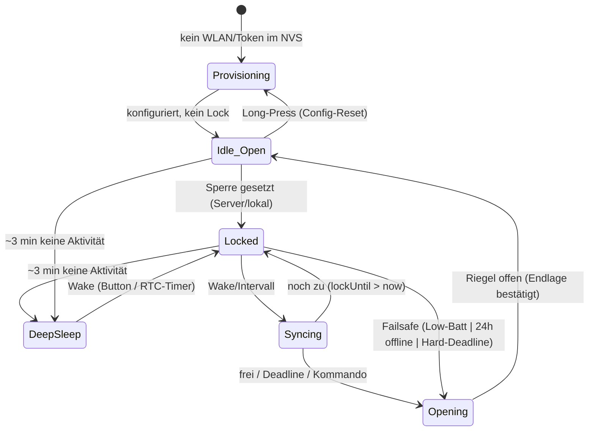

# Eigene Lockbox „Heimdall" — Wunsch- & Anforderungsliste

**Codename:** Heimdall — der Wächter an der Bifröst, der sieht/hört wer kommt und geht und über Zugang entscheidet. Reiht sich in die Nordic-Namensgebung (midgard, asgard) ein.
**Stand:** 2026-07-07 (Code-Stand FW 0.1.78)
**Server / Backend:** chastitytracker.ch (self-hosted PWA + MCP)
**Hardware-Pfad (aktuell):** ESP32 WROOM-32 (LOLIN D32, LiPo-Lader onboard) · 28BYJ-48 + ULN2003 · LiPo · Brain-Transfer in die Ziel-Mechanik

---

## Wozu diese Liste

Sammelstelle für alles, was dir im **Betrieb der Ziel-Box** auffällt und was du in der **eigenen Umsetzung besser** haben willst. Lebendes Dokument — einfach unten in der jeweiligen Domäne ergänzen, neue Punkte kommen in den **Parkplatz** (Abschnitt 10) und werden später einsortiert.

**Prioritäten:**
- **P0** — Sicherheitskritisch, nicht verhandelbar. Muss stehen, bevor du je den Schlüssel einschliesst.
- **P1** — Kernfunktion. Ohne das ist es keine brauchbare Lockbox.
- **P2** — Komfort / Kür.

**Status-Marker:** `[ ]` offen · `[~]` in Arbeit · `[x]` erledigt · `[?]` zu klären/entscheiden

> **Hinweis zur Bauart:** Dies ist eine **Schlüssel-Box** (hält den KG-Schlüssel), kein am Körper getragenes Teil. Das verändert die Sicherheitslogik gegenüber der ersten Fassung deutlich — Notausgang ist physisch (Box aufbrechen), siehe Abschnitt 1.

---

## Architektur-Entscheide (bereits fix)

- [x] **Standalone-fähig** — Box funktioniert mit dem Tracker **und** als eigenständiges Tool ohne ihn. Tracker ist optionale Kür, nicht Voraussetzung. Heisst: alle Safety-Funktionen und ein Basis-Lock/Unlock müssen rein lokal laufen.
- [x] **Web statt Bluetooth** — Steuerung/Policy über den Server (WiFi), kein direktes BLE-Pairing.
- [x] **Pull-Modell** — Box meldet sich am Server an und **bezieht** von dort ihre Daten.
- [x] **Identitätsbindung über Device-Token** (beim Flashen ins NVS provisioniert). Solange Single-User: kein Claim-Code-Flow nötig. Server kennt Token → trublue.
- [x] **Deep-Sleep/Standby nach ~3 min** (wie die Ziel-Box, für Akkulaufzeit). Aufwachen per Taster, RTC-Deadline oder Low-Batt-Event.
- [x] **Sync ereignisgesteuert** — beim Aufwachen / **spätestens beim „Anschalten"**. Kein Dauer-Polling.
- [x] **Zwei Timer, klare Zuständigkeit:**
  - **Box-lokaler Timer = sicherheitsführend** („Öffnen spätestens bei …"). Läuft auch im Deep-Sleep über RTC, auch offline.
  - **Server-Timer = absichtsführend** („Sperren bis …", Keyholder-Sicht). Dient Anzeige + Policy.
  - Abgleich beim Sync. **Die Box bleibt nie über ihr eigenes Hard-Deadline hinaus zu**, egal was der Server sagt.

---

## 1. Sicherheit & Failsafe — **P0, nicht verhandelbar**

> **Modell: Zerstören-zum-Befreien.** Da es eine Schlüssel-Box ist und kein Körperteil, ist der Notausgang physisch: **PLA-Gehäuse mit Scheibe vorne — im Notfall einschlagen, Schlüssel raus.** Bewusst **keine** mechanische Notentriegelungs-Mechanik. Das ist ein sauberes, klassisches Time-Lock-Box-Prinzip, solange die Box physisch erreichbar bleibt. Die Firmware-Öffnungen unten sind dann **Komfort** (Box im Normalfall nicht zerstören müssen), nicht die Lebenssicherung — die liegt in der Scheibe.

- [x] **Entscheid: keine Notentriegelung.** Notausgang = Scheibe einschlagen (PLA, billig nachzudrucken, stromunabhängig, jederzeit verfügbar). Deckt die Lebenssicherheit ab.
- [x] **Low-Battery-Auto-Open** — öffnet selbsttätig bei ≤15 % (`failsafe.h isLowBattery`, `BATT_CRITICAL_PCT`); `BATT_UNKNOWN`-Schutz gegen fehlenden Sensor (sonst fälschlich „0 % = leer"). _(FW 0.1.78; Hysterese/Vorwarnung noch nicht implementiert.)_
- [x] **24-h-ohne-Internet-Auto-Open** — `Failsafe::isOfflineTimeout` über monotonen `offlineSeconds`-Zähler (clock-unabhängig, überlebt Brownout/1970-Uhr in NVS). Reset nur bei erfolgreichem Sync.
- [x] **Box-lokaler Hard-Deadline** — `lockUntil` in NVS, RTC-Wake exakt zur Deadline (`goDeepSleep`), `isPolicyExpired` öffnet zeitbasiert nur bei gültiger Uhr.
- [~] **Positions-Persistenz in NVS** — logischer `locked`-Zustand überlebt Deep-Sleep via NVS (kein undefinierter Zustand). **Physisch ungemessen** (kein Endlagensensor → `boltPos=UNKNOWN`). Ein Sensor ist **nicht geplant** (keine HW); Korrektur bei klemmendem Riegel über die User-Meldung „erneut öffnen" (Abschnitt 2).
- [x] **Hardware-Watchdog** gegen Firmware-Hänger — dedizierter HW-Timer (`watchdog.h`/`.cpp`, unabhängig vom Core-Task-WDT), 30 s Timeout, ISR→Reboot. Nur im Wach-Zustand scharf; lange Blocker (WiFi-Connect, Provisioning-Hotspot, OTA-Download) füttern selbst. Selbstheilung, unabhängig von WLAN/Server (FW 0.2.10).
- [ ] **Brown-out-Detector** aktiv konfiguriert.
- [ ] **Limits abgleichen** `[?]` — 24-h-Offline-Open (Konnektivitäts-Failsafe, Obergrenze) vs. Keyholder-Cap 12 h (Policy darunter): klären, welches wann greift. Faustregel: Failsafe ist die harte Obergrenze, Keyholder-Zeit darf nie darüber.

**Leitprinzip (festhalten):** _Safety vor Security vor Funktion._ Keine digitale Schutzmassnahme und kein Server-Kommando darf die physische Befreiung (Scheibe) oder die lokalen Auto-Open-Failsafes aushebeln.

---

## 2. Mechanik & Aktor — **P1**

> Mit dem Zerstören-zum-Befreien-Modell entfällt der Zwang zu mechanischem Fail-open: dass der Stepper seine Position **stromlos hält**, ist jetzt ein reines **Feature** (kein ungewolltes Öffnen bei Akku-leer/Reset). Das garantierte Öffnen übernehmen die Firmware-Failsafes (Low-Batt, 24 h offline, Hard-Deadline) bzw. im Ernstfall die Scheibe.

- [x] 28BYJ-48 + ULN2003 als Aktor bestätigt — Pins in `config.h` (GPIO 23/17/16/4 per Debug-Sweep), `stepper.cpp`, auf/zu am Bench verifiziert. Selbsthalt stromlos passt.
- [x] ~~**Endlagen-Erkennung** (Hall/Mikroschalter)~~ — **verworfen: keine Hardware dafür.** `boltPos` bleibt geschätzt (open-loop). Ersatz-Fallback (umgesetzt, FW 0.2.0): Steht die Box auf „offen", klemmt der Riegel aber, meldet der User das auf der Website („Riegel klemmt? Erneut öffnen fahren") → `reopen`-Kommando → `Stepper::reopen()`: kurzer Rückzug Richtung ZU (löst Verkanten), dann **ein** voller Öffnungshub — bewusst auf den bekannten Gesamtweg gedeckelt (kein stumpfes Weiterdrücken gegen den Anschlag → schont Schritte/Strom auf 350 mAh). Instant im MQTT-Wachfenster, sonst beim nächsten Sync.
- [ ] Riegel-Hub und Drehmoment so auslegen, dass der Riegel sicher öffnet, wenn ein Failsafe feuert (genug Reserve-Energie eingeplant, siehe Abschnitt 3).
- [ ] Mechanik so, dass der Schlüssel im offenen Zustand wirklich entnehmbar ist (keine Restverriegelung).

---

## 3. Energie & Laden — **P1**

- [ ] LiPo-Kapazität so dimensionieren, dass **Max-Verschlusszeit + Reserve fürs Öffnen** sicher abgedeckt sind (mit Sicherheitsfaktor).
- [ ] **Laden im verschlossenen Zustand** möglich (USB-Zugang von aussen am Gehäuse). Das kann die Ziel-Box — behalten.
- [x] **Akkustand-Messung** — `Failsafe::batteryPercent()` (GPIO32, 1:2-Teiler, 16× gemittelt, am Multimeter kalibriert), Basis der Low-Batt-Logik.
- [x] Ladeverhalten: `readChargeState()` (GPIO26 = USB dran, GPIO13 = TP4056-STDBY) — reine Erkennung, Einstecken löst keinen Reset/Öffnen/Zustandswechsel aus.

---

## 4. Konnektivität, Standby & Sync — **P1**

> WiFi-first (siehe Architektur-Entscheide). Kernthema hier: **Sync trotz Deep-Sleep**. Die Box schläft ~3 min nach Aktivität ein (Akku!), kann also nicht dauernd pollen. Lösung: ereignisgesteuerter Sync + RTC-gestützte Safety-Weckung.

- [x] **Anmeldung am Server** beim ersten Boot: Box registriert sich mit Device-Token (`/api/box/register`), Server ordnet sie zu.
- [x] **Sync-Zeitpunkte:** beim Aufwachen aus Standby, beim Taster-„Anschalten", per RTC-Timer-Wake (`WAKE_INTERVAL_S` 5 min, oder früher bei näherer Deadline). Spätestens bei jedem „Anschalten" wird gesynct.
- [x] **Was beim Sync passiert:** Box pusht realen Zustand (auf/zu, seit wann, Akku) → zieht Soll (`serverLocked`, `lockUntil`, `offlineOpenHours`) → rechnet lokal (immer ≤ Failsafe-Obergrenze). `lockedSince` server-autoritativ („gesperrt seit"-Telemetrie).
- [x] **Offline-Verhalten:** Box arbeitet mit dem zuletzt gesyncten Soll weiter (NVS-Policy); nach 24 h feuert der Offline-Auto-Open. Standalone (Simple-Lock ohne Deadline) läuft ebenso.
- [x] **Verbindung User ↔ Box im Moment der Bedienung** — physischer **Taster** (GPIO14, EXT0-Wake) = Intent + Wake; Autorisierung kommt aus dem Server-Sync. Umgesetzt.
- [ ] **Push für schnelles Keyholder-Feedback?** `[?]` — **wird gerade neu bewertet (2026-07-07):** heutige Worst-Case-Latenz Server→Box bis 5 min (Deep-Sleep). In Prüfung: Light-Sleep-connected + „Türklingel"-Push (MQTT/WebSocket), wobei die Autorität auf dem gehärteten HTTPS-Sync bleibt. Ursprünglicher Entscheid „bewusst gegen Dauerverbindung" ist damit offen.
- [x] **OTA-Update** über eigenen Server, **Ed25519-signiert** (`ota.cpp`, fail-closed ohne Signatur), mit Rollback-Validierung.
- [x] **WLAN-Provisioning ohne Reflash** (Captive Portal, `provisioning.cpp`) + Multi-WLAN/bevorzugtes Netz per Sync, ohne die Box zu öffnen.

---

## 5. chastitytracker.ch-Integration — **P1**

> Die Box wird das **erste Gerät, das echte Hardware-Wahrheit** in den Tracker schreibt — statt deiner manuellen Selbstauskunft.

- [ ] Verschliessen/Öffnen der Box erzeugt **automatisch** `VERSCHLUSS`/`OEFFNEN`-Einträge.
- [ ] Keyholder-`set_lock_period` / Sperrzeit wirkt **direkt** auf die Box (Server sagt „zu bis X" → Box vollzieht, im Rahmen der lokalen Failsafes).
- [ ] **Reinigungspausen** als überwachte Öffnung mit Timer abbilden (aktuell: max. 15 min/Pause, 2 min/Tag) — Box öffnet kurz, zählt mit, schliesst selbst wieder.
- [ ] **Foto-Inspektion** (`request_inspection`): Box zeigt/bestätigt den Code.
- [ ] **Strafbuch**: hardwareseitig erkanntes unautorisiertes Öffnen → automatischer Eintrag statt Ehrensystem.
- [ ] Trainingsziele (KG Stufe-2: 12 h/Tag) — Box liefert die echten Tragestunden statt geschätzter.

---

## 6. Keyholder-Erlebnis (Mensch im Loop) — Kernmotivation

> Hier die eigentliche Motivation festhalten, damit sie das Design führt: Der Reiz liegt in der **Übergabe an eine vertraute menschliche Keyholderin**, nicht in der Selbstverwaltung. Solo ist strukturell unvollständig. **Die Box soll diese Übergabe technisch tragen — nicht ersetzen.**

- [ ] Remote-Steuerung für die Keyholderin **über die Tracker-UI**, kein App-Zwang, kein Hersteller-Cloud-Account.
- [ ] Klares Rollenmodell: Keyholderin setzt Zeiten/Ziele **innerhalb** der Safety-Caps; Box vollzieht; Hard-Limits bleiben unantastbar.
- [ ] Optionale „Anstachel"-Mechanik passend zu den Keyholder-Regeln (sie reizt zu mehr Erregung) — **optional, vorsichtig, jederzeit abschaltbar.** `[?]`
- [ ] Übergabe-/Rückgabe-Ritual technisch sauber: definierter Moment, ab dem Kontrolle wechselt.

---

## 7. Bedienung & Alltag — **P2**

- [x] **Taster** an der Box: Wake aus Standby (EXT0/GPIO14) + User-Intent (Sync jetzt). Umgesetzt.
- [~] Statusanzeige hinter der Scheibe: Onboard-LED zeigt Lock-Zustand (`PIN_LED`, active-low); kleines Display noch offen.
- [ ] **Stiller Modus** — diskret, keine auffälligen Signale, wenn die Box irgendwo herumsteht.

---

## 8. Gehäuse — **P2** (Schlüssel-Box, nicht am Körper)

- [x] **PLA-Gehäuse mit Scheibe vorne** als bewusster Notausgang (einschlagen → Schlüssel raus).
- [ ] Scheibe richtig dimensionieren: hält normalen Gebrauch/Transport aus, lässt sich aber im Notfall **bewusst und ohne Spezialwerkzeug** einschlagen.
- [ ] Aussenmasse: D32 (57 × 25.4 mm) + Stepper + LiPo einpassen; ESP32MiniKit (~34.5 × 25.5 mm) als kompakte Alternative.
- [ ] Stecker-Überstand (USB-C, JST) einplanen; Lade-USB von aussen erreichbar.
- [ ] Taster nach aussen geführt.
- [ ] Schlüsselfach so, dass nach Einschlagen der Scheibe der Schlüssel wirklich greifbar ist.

---

## 9. Security (digital) — **P1**

- [x] **Identitäts-/Auth-Token** Box ↔ Server — 80-Bit-Token beim Provisioning ins NVS, `Authorization: Bearer` gegen bcrypt-`tokenHash`. TLS cert-gepinnt (ISRG-Roots in `certs.h`). Optional mTLS noch offen.
- [x] Keine Klartext-Credentials, kein offenes BLE-Pairing (WiFi-only, kein BLE).
- [ ] **Replay-Schutz** für Einzelkommandos (signiert, zeitgebunden) — heute nur TLS-Transportschutz; relevant, sobald ein Push-Kanal Kommandos trägt (Abschnitt 4).
- [ ] **Grenze:** digitale Security darf die physische Befreiung (Scheibe) und die lokalen Auto-Open-Failsafes (Abschnitt 1) **niemals** aushebeln. Ein kompromittierter/abwesender Server darf dich nicht dauerhaft einsperren.

---

# Architektur-Spezifikation

> Konkretisierung der Wunsch-Domänen oben in einen konsistenten Bauplan. Stand 2026-06-06.

## A. Server-Topologie

**Drei Schichten, klar getrennt:**

| Schicht | Rolle | Verfügbarkeit |
|---|---|---|
| **Box** (ESP32) | Hardware-Wahrheit + lokale Safety. Hält den realen Riegelzustand, erzwingt Deadline/Low-Batt/Offline-Open autonom. | Immer (auch offline) |
| **Steuerserver** | Absicht + Auth + OTA. Hält die *gewollte* Sperrzeit pro Gerät, authentifiziert die Box per Token, liefert Zeit. **Standalone-fähig** — betreibt die Box vollständig ohne Tracker. | Hoch (klein, gehärtet) |
| **Tracker** (chastitytracker.ch) | System of Record: Sessions, Ziele, Keyholder-Regeln, Strafbuch, Historie, Ritual. **Optional** nachgelagert. | Darf ausfallen, ohne die Box-Steuerung mitzureißen |

**Leitsatz:** Die Box redet **ausschließlich** mit dem Steuerserver und weiß nicht, dass der Tracker existiert. „Tracker-Light" = Steuerserver mit Sync = off. „Server + Tracker-Sync" = Steuerserver mit Sync = on. **Ein Artefakt, Sync ist ein Feature-Flag.**

**Box↔Steuerserver-Vertrag (minimal, versioniert):**
- `register(token)` → Geräte-Config `{lockUntil, offlineOpenHours, timeUTC, fwTarget}`
- `sync(token, state{locked, since, battery, boltPos, fwVersion, wakeReason})` → `{lockUntil, offlineOpenHours, timeUTC, otaAvailable, commands[]}`

**Sync-Vertrag Steuerserver↔Tracker (zwei Richtungen):**
- **Absicht** (Tracker → Steuerserver): Keyholder setzt „sperren bis X" / Ziele (`set_lock_period`, `set_training_goal`) → Steuerserver serviert es der Box.
- **Fakten** (Steuerserver → Tracker): reale Box-Events → `VERSCHLUSS`/`OEFFNEN`-Einträge, Akku, erkanntes unautorisiertes Öffnen → Strafbuch.

**Deployment (passt zu Stack):** Steuerserver als eigener Container hinter Traefik, eigene Subdomain (z. B. `heimdall.selfgeek.ch`), **eigene DB** (nicht Tracker-DB mitbenutzen → sonst Kopplung durch die Hintertür). Sync über expliziten API-/Webhook-Kontrakt.

---

## B. Kanonischer Ablauf

**Provisioning (einmalig, kein Reflash):**
1. Box einschalten → startet als AP mit Captive Portal (SSID z. B. „Lockbox-Setup", passwortgeschützt).
2. Im Tracker vorab **„neue Box anlegen" → Token** generieren.
3. Im Captive Portal: WLAN-Credentials + Steuerserver-URL + **Token** eintragen.
4. OK → Reboot → Box verbindet sich, meldet sich mit Token am Steuerserver → **sofort mit Account verknüpft**. Kein Account-Generieren durch die Box, kein Pending-Schritt.

**Sync-Zyklus (Pull, ereignisgesteuert):**
- Haupt-Sync **beim Aufwachen** (spätestens beim „Anschalten"). Während des kurzen Wach-Fensters optional alle X s nachfragen. Kein Dauer-Polling.
- Box pusht realen Zustand → zieht Soll (`lockUntil`, Kommandos, Zeit) → rechnet lokalen Hard-Deadline neu (immer ≤ Failsafe-Obergrenze).
- **Zeitabgleich bei jedem Aufwachen** (RTC driftet im Sleep).

**Button kurz:** Wake → **zuerst lokale Safety-Checks** (Deadline? Low-Batt? → öffnen, egal ob Server erreichbar) → **dann** Sync für neue Instruktionen.

**Button lang (≥ 5 s):** WLAN + Steuerserver-Config aus NVS löschen → AP-Modus. **Aktive Session wird NICHT gelöscht** — sie ist an die Server-Identität gebunden, die sie eröffnet hat. Ein frisch konfigurierter *anderer* Server kann eine laufende Session nicht öffnen, nur die 24 h aussitzen.

---

## C. State-Machine (Box)

**Übergangs-Regeln:**
- **Öffnen gewinnt immer lokal:** Failsafe-Übergänge (Low-Batt / 24 h offline / Hard-Deadline) feuern unabhängig von Server/WLAN.
- **Riegelzustand persistent in NVS** — nach Wake aus DeepSleep kennt die Box ihren realen Zustand (+ Endlagensensor als Wahrheit).
- **Jeder Öffnen-Übergang protokolliert seinen `wakeReason`/Grund** und meldet ihn beim nächsten Sync (→ Strafbuch bei nicht-autorisierten Gründen).

---

## D. Transplant-Verifikation (1:1-Garantie)

> „1:1" liegt **nicht** im Board-Footprint, sondern im **CN3-Vertrag + identischem Stepper + gleicher Logikpegel**. Die Ziel-Treiberplatine ist „dumm" (ULN2003 + TP4056 + Regler, **kein MCU**) → kein proprietäres Protokoll, 1:1 per Konstruktion möglich.

> **Befund (empirisch bestätigt 2026-06-07):** Der **USB-C der Ziel-Box ist charge-only**. Test an Mac (`ls /dev/cu.*`) und Pi (`dmesg -wH`): iPhone als Gegenprobe enumeriert sauber (Kabel/Setup belegt), die Ziel-Box meldet sich **gar nicht** als USB-Gerät an (D+/D- machen keine USB-Aushandlung). → Stock-Platine ist **nicht per USB flashbar**; deshalb Brain-Transfer bzw. Serial-Pins/Pogo, falls je direkt geflasht wird.

1. [x] **CN3 durchgemessen** — ULN2003-Pinbelegung per Debug-Sweep ermittelt (GPIO 23/17/16/4), auf/zu bestätigt. Ergebnis in `config.h`.
2. [x] **Stock-Controller-Pegel** — 3.3-V-Logik bestätigt (Firmware treibt den Stepper direkt auf der Ziel-Treiberplatine).
3. [x] **Bench-Replikat** — identischer 28BYJ-48 + ULN2003, Firmware-Antrieb bewiesen.
4. [x] **CN3-Adapter/Harness** — D32-GPIOs → CN3 gemäß Pin-Map, boot-strapping-sichere GPIOs, Wake-Taster auf RTC-GPIO14. Firmware läuft auf der Original-Platine.
5. [x] **An der Box kalibriert** — `STEPPER_LOCK_STEPS` auf realen Riegelweg. „Fahre bis Endlage" noch offen (Endlagensensor, Abschnitt 2) — aktuell blind N Schritte.

**Absicherung:** Stock-Controller nur abstecken, **nicht zerstören** → Transplant reversibel. Voll-Flash-Backup (`read_flash 0 0x400000 …`) nur nötig, falls später die Stock-Platine selbst geflasht wird.

---

## E. Bedrohungsmodell / Cheat-Pfade

**Axiom:** *Security = Sichtbarkeit + Keyholder-Beziehung, nicht Unentrinnbarkeit.* Ein selbstverwaltetes Gerät mit Glasscheibe ist nie cheat-sicher — und soll es nicht sein. **Jeder Failsafe ist ein dokumentierter Cheat-Pfad, kein Loch.** Die „Zähne" sitzen in der Protokollierung und der Beziehung, nicht in der Mechanik.

| Cheat-Pfad | Aufwand | Mitigation = nicht verhindern, sondern **sichtbar machen** |
|---|---|---|
| Scheibe einschlagen | Sekunden | Physisch offensichtlich; bewusster Notausgang |
| Akku ziehen / leerlaufen | Minuten–Stunden | Low-Batt-Open nur bei **real gemessener** Schwelle; **loggen** + Strafbuch |
| DNS biegen / WLAN blocken | **24 h warten** | 24-h-Offline-Open; `wakeReason=offline_timeout` → Strafbuch beim Reconnect |
| Auf Fake-Steuerserver umkonfigurieren | — (geschlossen) | Session an Server-Identität gebunden → fremder Server kann laufende Session **nicht** öffnen |

**Designprinzip:** Die Box protokolliert **immer den Öffnungsgrund** und meldet ihn beim nächsten Reconnect. Cheaten kostet nicht die Mechanik, sondern die Ehrlichkeit gegenüber der Keyholderin — und genau das ist gewollt.

---

## 10. Parkplatz / offene Ideen

> Roh-Einträge hier rein, später einsortieren.

- _(deine Beobachtung aus dem Betrieb der Ziel-Box …)_
- _(…)_

---

## Changelog

- **2026-06-06** — Dokument angelegt; Domänen 1–9 aus bisherigen Gesprächen + Schwachstellen der Ziel-Box geseedet, an aktuelles Tracker-Setup angeglichen (12-h-Cap, Reinigungsregeln, Stufe-2-Ziel).
- **2026-06-06 (Update)** — Bauart als **Schlüssel-Box** geklärt (nicht am Körper). Sicherheitsmodell auf **Zerstören-zum-Befreien** (PLA + Scheibe) umgestellt, **keine Notentriegelung** als bewusster Entscheid. Failsafes: Low-Batt-Open + 24-h-Offline-Open + lokaler Hard-Deadline. Neuer Abschnitt **Architektur-Entscheide** (standalone-fähig, Web statt BLE, Pull-Modell, Device-Token, Deep-Sleep, ereignisgesteuerter Sync, Zwei-Timer-Modell). Abschnitte 2/3/4/7/8/9 entsprechend angepasst.
- **2026-06-06 (Architektur-Spezifikation)** — Neuer Teil A–E ergänzt: (A) Server-Topologie 3-Schichten Box/Steuerserver/Tracker + minimaler Vertrag + Deployment, (B) kanonischer Ablauf Provisioning/Sync/Button/Long-Press, (C) State-Machine (Mermaid + Regeln), (D) Transplant-Verifikation CN3→Bench→Adapter→Kalibrierung, (E) Bedrohungsmodell/Cheat-Pfade mit Leitaxiom „Sichtbarkeit + Keyholder-Beziehung statt Unentrinnbarkeit".
- **2026-06-06 (Codename)** — Projekt heißt **Heimdall**. Titel, Kopf und Deployment-Subdomain (`heimdall.selfgeek.ch`) entsprechend gesetzt.
- **2026-06-07 (Befund)** — USB-C der Ziel-Box empirisch als **charge-only** bestätigt (Mac + Pi, iPhone-Gegenprobe). In Abschnitt D dokumentiert. Brain-Transfer bleibt die Route.
- **2026-07-07 (Abgleich mit Code-Stand FW 0.1.78)** — Wunschliste an die reale Firmware angeglichen. Als erledigt markiert: alle P0-Failsafes (Low-Batt-, 24-h-Offline-, Hard-Deadline-Auto-Open, HardCap — `failsafe.h`, clock-unabhängig über monotone NVS-Zähler), Akkustand-/Lade-Erkennung, kompletter Sync-/Provisioning-Zyklus, Multi-WLAN, signierte OTA mit Rollback, Token-Auth + Cert-Pinning, Taster-Wake, sowie Transplant-Verifikation D1–D5 (Firmware läuft auf der Original-Platine). Teilweise (`[~]`): Positions-Persistenz (logisch ja, physisch ungemessen) und Statusanzeige (LED ja, Display nein). Weiterhin offen: Endlagen-Erkennung, Hardware-Watchdog, Brown-out-Config, Replay-Schutz für Einzelkommandos. **Neu aufgerollt:** §4 „Push für schnelles Keyholder-Feedback" — der ursprüngliche Entscheid gegen eine Dauerverbindung wird zugunsten besserer Website-Responsivität neu bewertet (Light-Sleep-connected + Türklingel-Push, Autorität bleibt auf dem HTTPS-Sync).
- **2026-07-07 (FW 0.2.0 — MQTT-Push)** — §4 umgesetzt als **Session-Fenster-MQTT**: Button/USB öffnet ein ~2-min-Wachfenster mit Live-MQTT (open/close/lock/reopen <2 s, „Box online" via LWT); dormant schläft die Box zwischen **stündlichen** Heartbeat-Syncs (12× weniger Wakes als vorher). Direkt-Kommandos über MQTT, autoritative Policy weiter über den cert-gepinnten HTTPS-Sync; lokale Failsafes unangetastet autoritativ (Safety-Invariante gewahrt). Server: Mosquitto-Broker (go-auth-HTTP-Backend, Reuse der Device-Token), `mqttBridge` + `mqttEnabled`-Flag pro Box (Default aus → schrittweiser Rollout). Endlagensensor verworfen (keine HW) → User-gemeldeter Riegel-Retry (`reopen`).
- **2026-07-07 (FW 0.2.9 — HardCap entfernt)** — Der **HardCap** (absolute Zeit-Obergrenze ab Verschluss) fällt komplett weg: Server (`hardCapHours`-Spalte + `effectiveLockUntil`-Kappung + UI-Feld) und Firmware (`isHardCapExceeded`, monotoner `lockedSeconds`-Zähler) bereinigt. Begründung: Der Keyholder öffnet jederzeit übers Dashboard (Notfall-Passwort/-Phrase), der Cap war nur ein User-Schutz und verwirrte durch stille Kappung der eingestellten Sperrzeit. Verbleibende lokale Failsafes: Low-Batt, 24-h-Offline, Zeit-Deadline (`isPolicyExpired`). Rückwärtskompatibel: Server sendet kein `hardCapHours` mehr → alte Firmware liest `0` → Cap inert; `hard_deadline` bleibt vorerst als legitimer Open-Reason gelistet (in-field-Boxen vor OTA).
  - **Server-Fix (nebenbei):** Ein regulärer Sperrzeit-Ablauf (Box öffnet autonom beim `rtc_timer`-Wake) wurde als `UNAUTHORIZED_OPEN` (Tamper-Fehlalarm) protokolliert. Neuer `timedLockExpired`-Zweig: legitim, wenn der Server die Box selbst nicht mehr gesperrt sieht UND eine timed Sperre real abgelaufen ist → `UNLOCKED`. Echtes Tampering (Früh-Öffnen, Simple-Lock, Tracker-Sperre) bleibt `UNAUTHORIZED_OPEN` (adversarial verifiziert).
- **2026-07-07 (FW 0.2.10 — Hardware-Watchdog)** — Dedizierter HW-Timer-Watchdog (`watchdog.h`/`.cpp`): rebootet die Box bei einem Firmware-Hänger (kein feed > 30 s → Timer-ISR → `esp_restart()` → frischer `setup()`, re-evaluiert alle Failsafes). Bewusst UNABHÄNGIG vom Core-Task-WDT (der auf idle-CPU0 mit 5 s läuft und nicht neu konfiguriert werden kann, ohne einen Reboot-Loop zu riskieren). Scharf ab dem ersten `loop()`-Eintritt (`setup()` + Dev-Test-Modi bleiben unbewacht); je Iteration gefüttert, lange Blocker füttern selbst (WiFi-Connect, Provisioning-Hotspot, OTA-Download je Chunk). Timeout liegt bewusst über jedem legitimen Einzelblocker. Reine Selbstheilung gegen Aufhänger, unabhängig von WLAN/Server — kein Ersatz für die lokalen Failsafes.
