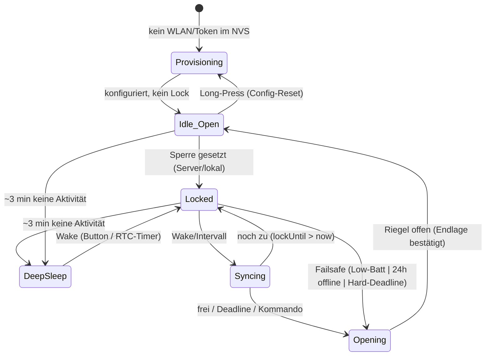

# Eigene Lockbox „Heimdall" — Wunsch- & Anforderungsliste

**Codename:** Heimdall — der Wächter an der Bifröst, der sieht/hört wer kommt und geht und über Zugang entscheidet. Reiht sich in die Nordic-Namensgebung (midgard, asgard) ein.
**Stand:** 2026-06-06
**Server / Backend:** chastitytracker.ch (self-hosted PWA + MCP)
**Hardware-Pfad (aktuell):** ESP32 WROOM-32 (LOLIN D32, LiPo-Lader onboard) · 28BYJ-48 + ULN2003 · LiPo · Brain-Transfer in die LockMeBox-Mechanik

---

## Wozu diese Liste

Sammelstelle für alles, was dir im **Betrieb der LockMeBox** auffällt und was du in der **eigenen Umsetzung besser** haben willst. Lebendes Dokument — einfach unten in der jeweiligen Domäne ergänzen, neue Punkte kommen in den **Parkplatz** (Abschnitt 10) und werden später einsortiert.

**Prioritäten:**
- **P0** — Sicherheitskritisch, nicht verhandelbar. Muss stehen, bevor du je den Schlüssel einschliesst.
- **P1** — Kernfunktion. Ohne das ist es keine brauchbare Lockbox.
- **P2** — Komfort / Kür.

**Status-Marker:** `[ ]` offen · `[~]` in Arbeit · `[x]` erledigt · `[?]` zu klären/entscheiden

> **Hinweis zur Bauart:** Dies ist eine **Schlüssel-Box** (hält den KG-Schlüssel), kein am Körper getragenes Teil. Das verändert die Sicherheitslogik gegenüber der ersten Fassung deutlich — Notausgang ist physisch (Box aufbrechen), siehe Abschnitt 1.

---

## Architektur-Entscheide (bereits fix)

- [x] **Standalone-fähig** — Box funktioniert mit dem Tracker **und** als eigenständiges Tool ohne ihn. Tracker ist optionale Kür, nicht Voraussetzung. Heisst: alle Safety-Funktionen und ein Basis-Lock/Unlock müssen rein lokal laufen.
- [x] **Web statt Bluetooth** — Steuerung/Policy über den Server (WiFi), kein direktes BLE-Pairing.
- [x] **Pull-Modell** — Box meldet sich am Server an und **bezieht** von dort ihre Daten.
- [x] **Identitätsbindung über Device-Token** (beim Flashen ins NVS provisioniert). Solange Single-User: kein Claim-Code-Flow nötig. Server kennt Token → trublue.
- [x] **Deep-Sleep/Standby nach ~3 min** (wie LMB, für Akkulaufzeit). Aufwachen per Taster, RTC-Deadline oder Low-Batt-Event.
- [x] **Sync ereignisgesteuert** — beim Aufwachen / **spätestens beim „Anschalten"**. Kein Dauer-Polling.
- [x] **Zwei Timer, klare Zuständigkeit:**
  - **Box-lokaler Timer = sicherheitsführend** („Öffnen spätestens bei …"). Läuft auch im Deep-Sleep über RTC, auch offline.
  - **Server-Timer = absichtsführend** („Sperren bis …", Keyholder-Sicht). Dient Anzeige + Policy.
  - Abgleich beim Sync. **Die Box bleibt nie über ihr eigenes Hard-Deadline hinaus zu**, egal was der Server sagt.

---

## 1. Sicherheit & Failsafe — **P0, nicht verhandelbar**

> **Modell: Zerstören-zum-Befreien.** Da es eine Schlüssel-Box ist und kein Körperteil, ist der Notausgang physisch: **PLA-Gehäuse mit Scheibe vorne — im Notfall einschlagen, Schlüssel raus.** Bewusst **keine** mechanische Notentriegelungs-Mechanik. Das ist ein sauberes, klassisches Time-Lock-Box-Prinzip, solange die Box physisch erreichbar bleibt. Die Firmware-Öffnungen unten sind dann **Komfort** (Box im Normalfall nicht zerstören müssen), nicht die Lebenssicherung — die liegt in der Scheibe.

- [x] **Entscheid: keine Notentriegelung.** Notausgang = Scheibe einschlagen (PLA, billig nachzudrucken, stromunabhängig, jederzeit verfügbar). Deckt die Lebenssicherheit ab.
- [ ] **Low-Battery-Auto-Open** mit Hysterese — öffnet selbsttätig, solange garantiert noch Energie zum Öffnen da ist. Vorwarnung, dann öffnen. (Damit du die Box im Normalfall nicht aufbrechen musst.)
- [ ] **24-h-ohne-Internet-Auto-Open** — wenn der letzte erfolgreiche Server-Sync > 24 h zurückliegt, öffnet die Box. Schutz gegen „Server tot / WLAN weg / ausgesperrt".
- [ ] **Box-lokaler Hard-Deadline** in RTC/NVS — Box öffnet spätestens zum lokal gespeicherten Termin, unabhängig von Server/WLAN. (Das sicherheitsführende Timer aus den Architektur-Entscheiden.)
- [ ] **Positions-Persistenz in NVS** — nach Reset / Aufwachen aus Deep-Sleep weiss die Box real, ob auf oder zu. Kein undefinierter Zustand.
- [ ] **Hardware-Watchdog** gegen Firmware-Hänger.
- [ ] **Brown-out-Detector** aktiv konfiguriert.
- [ ] **Limits abgleichen** `[?]` — 24-h-Offline-Open (Konnektivitäts-Failsafe, Obergrenze) vs. Keyholder-Cap 12 h (Policy darunter): klären, welches wann greift. Faustregel: Failsafe ist die harte Obergrenze, Keyholder-Zeit darf nie darüber.

**Leitprinzip (festhalten):** _Safety vor Security vor Funktion._ Keine digitale Schutzmassnahme und kein Server-Kommando darf die physische Befreiung (Scheibe) oder die lokalen Auto-Open-Failsafes aushebeln.

---

## 2. Mechanik & Aktor — **P1**

> Mit dem Zerstören-zum-Befreien-Modell entfällt der Zwang zu mechanischem Fail-open: dass der Stepper seine Position **stromlos hält**, ist jetzt ein reines **Feature** (kein ungewolltes Öffnen bei Akku-leer/Reset). Das garantierte Öffnen übernehmen die Firmware-Failsafes (Low-Batt, 24 h offline, Hard-Deadline) bzw. im Ernstfall die Scheibe.

- [ ] 28BYJ-48 + ULN2003 als Aktor bestätigen. **Empfehlung:** behalten — Selbsthalt stromlos passt hier perfekt.
- [ ] **Endlagen-Erkennung** (Hall-Sensor oder Mikroschalter) statt blindem Schrittezählen → die Box kennt den realen Riegelzustand, nicht nur den gerechneten. Wichtig fürs ehrliche `VERSCHLUSS`/`OEFFNEN`-Logging.
- [ ] Riegel-Hub und Drehmoment so auslegen, dass der Riegel sicher öffnet, wenn ein Failsafe feuert (genug Reserve-Energie eingeplant, siehe Abschnitt 3).
- [ ] Mechanik so, dass der Schlüssel im offenen Zustand wirklich entnehmbar ist (keine Restverriegelung).

---

## 3. Energie & Laden — **P1**

- [ ] LiPo-Kapazität so dimensionieren, dass **Max-Verschlusszeit + Reserve fürs Öffnen** sicher abgedeckt sind (mit Sicherheitsfaktor).
- [ ] **Laden im verschlossenen Zustand** möglich (USB-Zugang von aussen am Gehäuse). Das kann die LockMeBox — behalten.
- [ ] **Akkustand-Messung** (ADC an Batteriespannung) als Basis für die Low-Batt-Logik aus Abschnitt 1.
- [ ] Ladeverhalten definieren: Einstecken darf **keinen** Reset/Öffnen/Zustandswechsel auslösen.

---

## 4. Konnektivität, Standby & Sync — **P1**

> WiFi-first (siehe Architektur-Entscheide). Kernthema hier: **Sync trotz Deep-Sleep**. Die Box schläft ~3 min nach Aktivität ein (Akku!), kann also nicht dauernd pollen. Lösung: ereignisgesteuerter Sync + RTC-gestützte Safety-Weckung.

- [ ] **Anmeldung am Server** beim ersten Boot: Box registriert sich mit Device-Token, Server ordnet sie trublue zu.
- [ ] **Sync-Zeitpunkte:** beim Aufwachen aus Standby, beim Taster-„Anschalten", und (optional) per RTC-Timer-Weckung in grossem Intervall. **Spätestens** bei jedem „Anschalten" wird gesynct, bevor die Box etwas tut.
- [ ] **Was beim Sync passiert:** Box pusht ihren realen Zustand (auf/zu, seit wann, Akku) → Box zieht die Soll-Vorgaben (Sperren-bis, Keyholder-Kommandos, Ziele) → Box rechnet ihren lokalen Hard-Deadline neu (immer ≤ Failsafe-Obergrenze).
- [ ] **Offline-Verhalten:** ohne Server arbeitet die Box mit dem zuletzt gesyncten Soll-Zustand weiter; greift kein Update, feuert nach 24 h der Offline-Auto-Open (Abschnitt 1). Standalone-Betrieb komplett ohne Server muss ebenso laufen.
- [ ] **Verbindung User ↔ Box im Moment der Bedienung** `[?]` — wie löst der User „ich will jetzt etwas" aus, wenn die Box schläft und es kein BLE/App gibt? **Vorschlag:** physischer **Taster** an der Box = Intent + Wake; die *Autorisierung* kommt dann aus dem Server-Sync. (Details unten im Chat.)
- [ ] **Push für schnelles Keyholder-Feedback?** `[?]` MQTT würde „sofort" wirken — kollidiert aber mit Deep-Sleep/Akku. Für eine Schlüssel-Box vermutlich unnötig: Keyholder-Kommandos greifen beim nächsten Aufwachen, die Safety läuft lokal. Bewusst gegen Dauerverbindung entscheiden.
- [ ] **OTA-Update** über eigenen Server, **signiert**.
- [ ] **WLAN-Provisioning ohne Reflash** (Captive Portal beim ersten Start), damit Credentials wechselbar sind, ohne aufzumachen.

---

## 5. chastitytracker.ch-Integration — **P1**

> Die Box wird das **erste Gerät, das echte Hardware-Wahrheit** in den Tracker schreibt — statt deiner manuellen Selbstauskunft.

- [ ] Verschliessen/Öffnen der Box erzeugt **automatisch** `VERSCHLUSS`/`OEFFNEN`-Einträge.
- [ ] Keyholder-`set_lock_period` / Sperrzeit wirkt **direkt** auf die Box (Server sagt „zu bis X" → Box vollzieht, im Rahmen der Hard-Caps).
- [ ] **Reinigungspausen** als überwachte Öffnung mit Timer abbilden (aktuell: max. 15 min/Pause, 2 min/Tag) — Box öffnet kurz, zählt mit, schliesst selbst wieder.
- [ ] **Foto-Inspektion** (`request_inspection`): Box zeigt/bestätigt den Code.
- [ ] **Strafbuch**: hardwareseitig erkanntes unautorisiertes Öffnen → automatischer Eintrag statt Ehrensystem.
- [ ] Trainingsziele (KG Stufe-2: 12 h/Tag) — Box liefert die echten Tragestunden statt geschätzter.

---

## 6. Keyholder-Erlebnis (Mensch im Loop) — Kernmotivation

> Hier die eigentliche Motivation festhalten, damit sie das Design führt: Der Reiz liegt in der **Übergabe an eine vertraute menschliche Keyholderin**, nicht in der Selbstverwaltung. Solo ist strukturell unvollständig. **Die Box soll diese Übergabe technisch tragen — nicht ersetzen.**

- [ ] Remote-Steuerung für die Keyholderin **über die Tracker-UI**, kein App-Zwang, kein Hersteller-Cloud-Account.
- [ ] Klares Rollenmodell: Keyholderin setzt Zeiten/Ziele **innerhalb** der Safety-Caps; Box vollzieht; Hard-Limits bleiben unantastbar.
- [ ] Optionale „Anstachel"-Mechanik passend zu den Keyholder-Regeln (sie reizt zu mehr Erregung) — **optional, vorsichtig, jederzeit abschaltbar.** `[?]`
- [ ] Übergabe-/Rückgabe-Ritual technisch sauber: definierter Moment, ab dem Kontrolle wechselt.

---

## 7. Bedienung & Alltag — **P2**

- [ ] **Taster** an der Box: Wake aus Standby + User-Intent (z. B. „Sync jetzt" / „ich will öffnen").
- [ ] Statusanzeige hinter der Scheibe (LED oder kleines Display): verschlossen / offen / Akku / Verbindung.
- [ ] **Stiller Modus** — diskret, keine auffälligen Signale, wenn die Box irgendwo herumsteht.

---

## 8. Gehäuse — **P2** (Schlüssel-Box, nicht am Körper)

- [x] **PLA-Gehäuse mit Scheibe vorne** als bewusster Notausgang (einschlagen → Schlüssel raus).
- [ ] Scheibe richtig dimensionieren: hält normalen Gebrauch/Transport aus, lässt sich aber im Notfall **bewusst und ohne Spezialwerkzeug** einschlagen.
- [ ] Aussenmasse: D32 (57 × 25.4 mm) + Stepper + LiPo einpassen; ESP32MiniKit (~34.5 × 25.5 mm) als kompakte Alternative.
- [ ] Stecker-Überstand (USB-C, JST) einplanen; Lade-USB von aussen erreichbar.
- [ ] Taster nach aussen geführt.
- [ ] Schlüsselfach so, dass nach Einschlagen der Scheibe der Schlüssel wirklich greifbar ist.

---

## 9. Security (digital) — **P1**

- [ ] **Identitäts-/Auth-Token** Box ↔ Server (beim Flashen provisioniert; siehe Architektur-Entscheide). Optional mTLS.
- [ ] Keine Klartext-Credentials, kein offenes BLE-Pairing wie bei der LockMeBox.
- [ ] **Replay-Schutz** für Kommandos (signiert, zeitgebunden) — vor allem für „Sperren-bis"-Verlängerungen.
- [ ] **Grenze:** digitale Security darf die physische Befreiung (Scheibe) und die lokalen Auto-Open-Failsafes (Abschnitt 1) **niemals** aushebeln. Ein kompromittierter/abwesender Server darf dich nicht dauerhaft einsperren.

---

# Architektur-Spezifikation

> Konkretisierung der Wunsch-Domänen oben in einen konsistenten Bauplan. Stand 2026-06-06.

## A. Server-Topologie

**Drei Schichten, klar getrennt:**

| Schicht | Rolle | Verfügbarkeit |
|---|---|---|
| **Box** (ESP32) | Hardware-Wahrheit + lokale Safety. Hält den realen Riegelzustand, erzwingt Deadline/Low-Batt/Offline-Open autonom. | Immer (auch offline) |
| **Steuerserver** | Absicht + Auth + OTA. Hält die *gewollte* Sperrzeit pro Gerät, authentifiziert die Box per Token, liefert Zeit. **Standalone-fähig** — betreibt die Box vollständig ohne Tracker. | Hoch (klein, gehärtet) |
| **Tracker** (chastitytracker.ch) | System of Record: Sessions, Ziele, Keyholder-Regeln, Strafbuch, Historie, Ritual. **Optional** nachgelagert. | Darf ausfallen, ohne die Box-Steuerung mitzureißen |

**Leitsatz:** Die Box redet **ausschließlich** mit dem Steuerserver und weiß nicht, dass der Tracker existiert. „Tracker-Light" = Steuerserver mit Sync = off. „Server + Tracker-Sync" = Steuerserver mit Sync = on. **Ein Artefakt, Sync ist ein Feature-Flag.**

**Box↔Steuerserver-Vertrag (minimal, versioniert):**
- `register(token)` → Geräte-Config `{lockUntil, offlineOpenHours, hardCaps, timeUTC, fwTarget}`
- `sync(token, state{locked, since, battery, boltPos, fwVersion, wakeReason})` → `{lockUntil, offlineOpenHours, timeUTC, otaAvailable, commands[]}`

**Sync-Vertrag Steuerserver↔Tracker (zwei Richtungen):**
- **Absicht** (Tracker → Steuerserver): Keyholder setzt „sperren bis X" / Ziele (`set_lock_period`, `set_training_goal`) → Steuerserver serviert es der Box.
- **Fakten** (Steuerserver → Tracker): reale Box-Events → `VERSCHLUSS`/`OEFFNEN`-Einträge, Akku, erkanntes unautorisiertes Öffnen → Strafbuch.

**Deployment (passt zu Stack):** Steuerserver als eigener Container hinter Traefik, eigene Subdomain (z. B. `heimdall.selfgeek.ch`), **eigene DB** (nicht Tracker-DB mitbenutzen → sonst Kopplung durch die Hintertür). Sync über expliziten API-/Webhook-Kontrakt.

---

## B. Kanonischer Ablauf

**Provisioning (einmalig, kein Reflash):**
1. Box einschalten → startet als AP mit Captive Portal (SSID z. B. „Lockbox-Setup", passwortgeschützt).
2. Im Tracker vorab **„neue Box anlegen" → Token** generieren.
3. Im Captive Portal: WLAN-Credentials + Steuerserver-URL + **Token** eintragen.
4. OK → Reboot → Box verbindet sich, meldet sich mit Token am Steuerserver → **sofort mit Account verknüpft**. Kein Account-Generieren durch die Box, kein Pending-Schritt.

**Sync-Zyklus (Pull, ereignisgesteuert):**
- Haupt-Sync **beim Aufwachen** (spätestens beim „Anschalten"). Während des kurzen Wach-Fensters optional alle X s nachfragen. Kein Dauer-Polling.
- Box pusht realen Zustand → zieht Soll (`lockUntil`, Kommandos, Zeit) → rechnet lokalen Hard-Deadline neu (immer ≤ Failsafe-Obergrenze).
- **Zeitabgleich bei jedem Aufwachen** (RTC driftet im Sleep).

**Button kurz:** Wake → **zuerst lokale Safety-Checks** (Deadline? Low-Batt? → öffnen, egal ob Server erreichbar) → **dann** Sync für neue Instruktionen.

**Button lang (≥ 5 s):** WLAN + Steuerserver-Config aus NVS löschen → AP-Modus. **Aktive Session wird NICHT gelöscht** — sie ist an die Server-Identität gebunden, die sie eröffnet hat. Ein frisch konfigurierter *anderer* Server kann eine laufende Session nicht öffnen, nur die 24 h aussitzen.

---

## C. State-Machine (Box)

**Übergangs-Regeln:**
- **Öffnen gewinnt immer lokal:** Failsafe-Übergänge (Low-Batt / 24 h offline / Hard-Deadline) feuern unabhängig von Server/WLAN.
- **Riegelzustand persistent in NVS** — nach Wake aus DeepSleep kennt die Box ihren realen Zustand (+ Endlagensensor als Wahrheit).
- **Jeder Öffnen-Übergang protokolliert seinen `wakeReason`/Grund** und meldet ihn beim nächsten Sync (→ Strafbuch bei nicht-autorisierten Gründen).

---

## D. Transplant-Verifikation (1:1-Garantie)

> „1:1" liegt **nicht** im Board-Footprint, sondern im **CN3-Vertrag + identischem Stepper + gleicher Logikpegel**. Die KSM-Treiberplatine ist „dumm" (ULN2003 + TP4056 + Regler, **kein MCU**) → kein proprietäres Protokoll, 1:1 per Konstruktion möglich.

> **Befund (empirisch bestätigt 2026-06-07):** Der **USB-C der LMB ist charge-only**. Test an Mac (`ls /dev/cu.*`) und Pi (`dmesg -wH`): iPhone als Gegenprobe enumeriert sauber (Kabel/Setup belegt), die LMB meldet sich **gar nicht** als USB-Gerät an (D+/D- machen keine USB-Aushandlung). → Stock-Platine ist **nicht per USB flashbar**; deshalb Brain-Transfer bzw. Serial-Pins/Pogo, falls je direkt geflasht wird.

1. [ ] **CN3 durchmessen** (nur an echter Box): jeder der 5 Pins → IN1–IN4 / GND / Vbat? + Versorgungsspannung. Ergebnis = Pin-Map-Tabelle.
2. [ ] **Optional: Stock-Controller an CN3 im Betrieb messen** → bestätigt Logikpegel (3.3 V) + Schrittsequenz/Richtung.
3. [ ] **Bench-Replikat** mit identischem 28BYJ-48 + ULN2003 → Firmware-Antrieb beweisen, bevor die Box angefasst wird.
4. [ ] **CN3-Adapter/Harness** bauen: D32-GPIOs → CN3 gemäß Pin-Map (GPIO-Wahl boot-strapping-sicher, Wake-Taster auf RTC-GPIO).
5. [ ] **An der Box kalibrieren** (einziger nicht vorab garantierbarer Teil): Schrittzahl auf realen Riegelweg, idealerweise „fahre bis Endlage" statt blind N Schritte.

**Absicherung:** Stock-Controller nur abstecken, **nicht zerstören** → Transplant reversibel. Voll-Flash-Backup (`read_flash 0 0x400000 …`) nur nötig, falls später die Stock-Platine selbst geflasht wird.

---

## E. Bedrohungsmodell / Cheat-Pfade

**Axiom:** *Security = Sichtbarkeit + Keyholder-Beziehung, nicht Unentrinnbarkeit.* Ein selbstverwaltetes Gerät mit Glasscheibe ist nie cheat-sicher — und soll es nicht sein. **Jeder Failsafe ist ein dokumentierter Cheat-Pfad, kein Loch.** Die „Zähne" sitzen in der Protokollierung und der Beziehung, nicht in der Mechanik.

| Cheat-Pfad | Aufwand | Mitigation = nicht verhindern, sondern **sichtbar machen** |
|---|---|---|
| Scheibe einschlagen | Sekunden | Physisch offensichtlich; bewusster Notausgang |
| Akku ziehen / leerlaufen | Minuten–Stunden | Low-Batt-Open nur bei **real gemessener** Schwelle; **loggen** + Strafbuch |
| DNS biegen / WLAN blocken | **24 h warten** | 24-h-Offline-Open; `wakeReason=offline_timeout` → Strafbuch beim Reconnect |
| Auf Fake-Steuerserver umkonfigurieren | — (geschlossen) | Session an Server-Identität gebunden → fremder Server kann laufende Session **nicht** öffnen |

**Designprinzip:** Die Box protokolliert **immer den Öffnungsgrund** und meldet ihn beim nächsten Reconnect. Cheaten kostet nicht die Mechanik, sondern die Ehrlichkeit gegenüber der Keyholderin — und genau das ist gewollt.

---

## 10. Parkplatz / offene Ideen

> Roh-Einträge hier rein, später einsortieren.

- _(deine Beobachtung aus dem LockMeBox-Betrieb …)_
- _(…)_

---

## Changelog

- **2026-06-06** — Dokument angelegt; Domänen 1–9 aus bisherigen Gesprächen + LockMeBox-Schwachstellen geseedet, an aktuelles Tracker-Setup angeglichen (12-h-Cap, Reinigungsregeln, Stufe-2-Ziel).
- **2026-06-06 (Update)** — Bauart als **Schlüssel-Box** geklärt (nicht am Körper). Sicherheitsmodell auf **Zerstören-zum-Befreien** (PLA + Scheibe) umgestellt, **keine Notentriegelung** als bewusster Entscheid. Failsafes: Low-Batt-Open + 24-h-Offline-Open + lokaler Hard-Deadline. Neuer Abschnitt **Architektur-Entscheide** (standalone-fähig, Web statt BLE, Pull-Modell, Device-Token, Deep-Sleep, ereignisgesteuerter Sync, Zwei-Timer-Modell). Abschnitte 2/3/4/7/8/9 entsprechend angepasst.
- **2026-06-06 (Architektur-Spezifikation)** — Neuer Teil A–E ergänzt: (A) Server-Topologie 3-Schichten Box/Steuerserver/Tracker + minimaler Vertrag + Deployment, (B) kanonischer Ablauf Provisioning/Sync/Button/Long-Press, (C) State-Machine (Mermaid + Regeln), (D) Transplant-Verifikation CN3→Bench→Adapter→Kalibrierung, (E) Bedrohungsmodell/Cheat-Pfade mit Leitaxiom „Sichtbarkeit + Keyholder-Beziehung statt Unentrinnbarkeit".
- **2026-06-06 (Codename)** — Projekt heißt **Heimdall**. Titel, Kopf und Deployment-Subdomain (`heimdall.selfgeek.ch`) entsprechend gesetzt.
- **2026-06-07 (Befund)** — LMB-USB-C empirisch als **charge-only** bestätigt (Mac + Pi, iPhone-Gegenprobe). In Abschnitt D dokumentiert. Brain-Transfer bleibt die Route.
